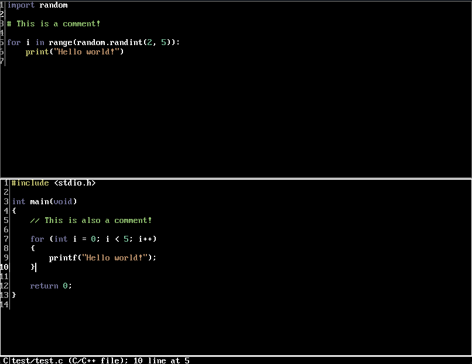
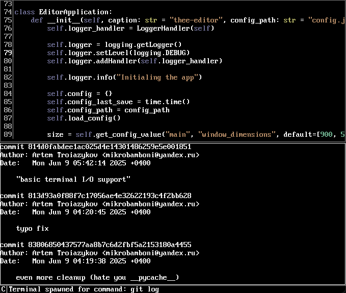

### What is it?
A simple Vi-inspired graphical text editor, WIP.

### Features
 - Bitmap VGA font
 - Several modes with their own shortcuts
 - Multiple commands: open/close/shell/etc.
 - Syntax highlighting (C/Json/Python)
 - Splitted view of several panes at the same time
 - Embedded terminal support

# Screenshots

